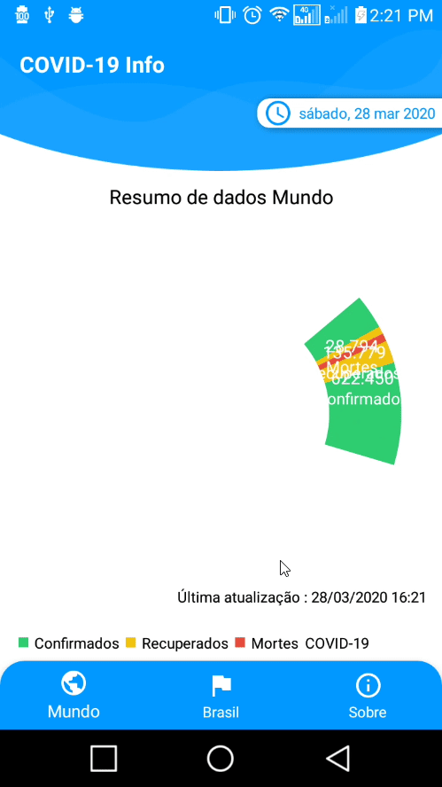

# COVID-19Info

> Version 1.0

> Application COVID-19Info

### Descrição do Projeto

COVID-19 Info é uma aplicação que mostra em um gráfico os resultados gerados pela pandemia provocada pelo Corona Vírus.

As informações exibidas são divulgadas por:
JHU CSSE
JHU - Johns Hopkins University
CSSE – Center For Systems Science and Engineering

Links úteis:
- [JHU CSSE](https://systems.jhu.edu/). 
- [COVID-19 API](https://github.com/mathdroid/covid-19-api). 
- [Ministério da Saúde - Painel Coronavírus](https://covid.saude.gov.br/).

### Bibliotecas :books:

[`Retrofit 2.7.1`](https://square.github.io/retrofit/) 
[`MPAndroidChart 3.1.0`](https://square.github.io/retrofit/)

### IDE :computer:

[`Android Studio`](https://developer.android.com/studio)

### Atênção :warning:

Fique em casa :house:

----

*mariodev@outlook.com.br*
